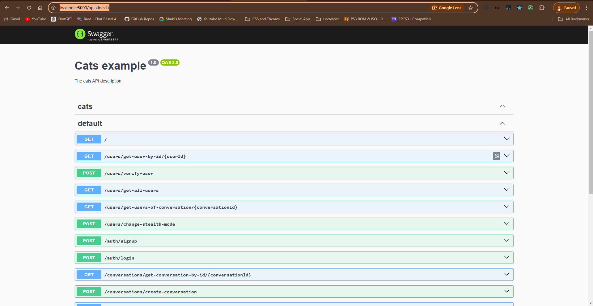

# Stealth Messaging App - Backend constructed with NestJS v10.

This is the backend service for the Stealth Messaging App, built with NestJS (version 10). It provides secure and encrypted messaging capabilities with End to End encryption.

## Table of Contents

- [Installation](#installation)
- [API Documentation](#api-documentation)
- [Features](#features)
- [Directory Structure](#directory-structure)
- [Usage](#usage)
- [Testing](#testing)
- [Contributing](#contributing)
- [License](#license)

---

## Installation

To set up the backend, follow these steps:

1. Clone the repository:
   ```bash
   git clone https://github.com/dewMyth/stealth-messaging-app.git
   cd stealth-messaging-app
   ```
2. Install Dependencies:
   ```bash
   npm install
   ```
3. Start the application
   ```bash
   npm run start:dev
   ```

## API Documentation

Go to http://localhost:5000/api-docs#/

#### API Documentation

Please find the API Docs constructed with OpenAPI Swagger documentation


## Features

1. User Authentication: Secure authentication using JWT.
2. Encrypted Messaging: Messages are encrypted for secure communication.
3. User Management: CRUD operations for user data and profiles.
4. Messaging: Endpoints for sending, receiving, and managing messages.
5. Error Handling: Comprehensive error handling and status codes.
6. Log Activities : Log Activities to monitor and track the actions user has taken sequentially/
7. Email Service: Sending Success and Failure notifications as emails using nodemailer
8. Scheduled/Cron Service: To track and realtime processing for the expiring messages that are scheduled to visible only for a given period of time

## Usage

1. Start the backend service using the following:

   ```bash
   npm run start:dev
   ```

2. Please find the Client Application Reference:

🔗 **[Stealth Messaging App Client](https://github.com/dewMyth/stealth-messaging-app-client)**

3. Follow the steps given in the Client Installation.

4. Same for the Socket Server that enables real time messaging:

🔗 **[Stealth Messaging App Socket Server](https://github.com/dewMyth/stealth-messaging-app-socket-server)**
